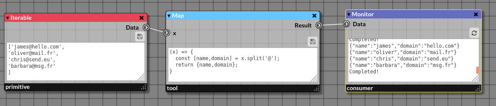

# Tinned - [Tin]y [N]ode [Ed]itor

`Tinned` is a visual programming language written in JavaScript, HTML and CSS. It is based on the **functional programming** paradigm and is fully reactive thanks to the _callbags_ design pattern.



## Install

### Requirements

You need:
- `git`
- `nodejs` and `npm`.

### Download the project

Clone this project by typing in a terminal:

```bash
git clone https://github.com/crazybiocomputing/tinned.git
```

Move in the newly created folder `tinned` 

```bash
cd tinned
```
...and for installing all the dependencies, type: 

```bash
npm install
```

## Use

Run the `http-server` by typing the following command in the `tinned` directory:

```bash
npm run start
```

Then open your favorite web browser and type the URL `localhost:8080`.
Try one of the examples located in the folder `examples`.
