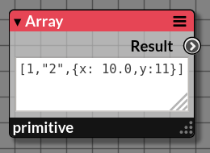

# Array

_Pullable node emitting an array &mdash; or list &mdash; of items_

|  |
|------------------------|
|Example of an array (or list) containing 3 items: a Number, a String and an Object|

## Inputs

_None_

## Properties
   
### Property Name

_Description_

## Outputs

### Output Name

_The output is an Array. The behavior is different of the node [Iterable](./iterable.md)_

## Example
## Related Nodes

_[Iterable](./iterable.md)_: Most of the time, the Node _[Iterable](./iterable.md)_ is preferred because we want to _pull_ each item in the stream rather than the whole array in one single _pull_.
