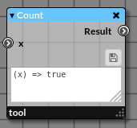
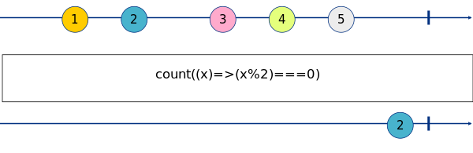
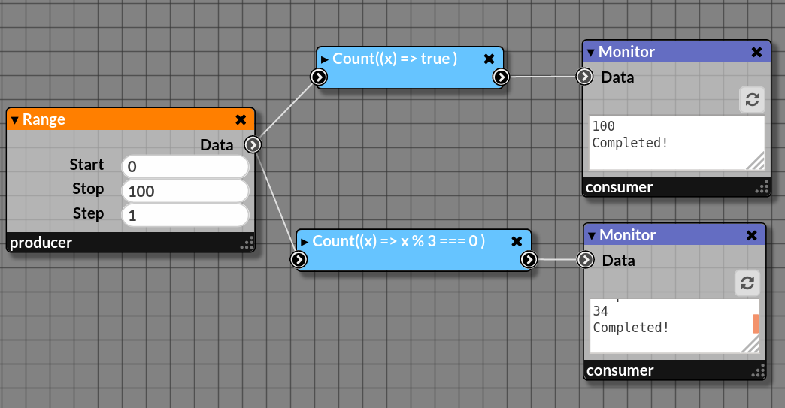

# Count

_Count the number of elements passing via the stream_

|  |
|------------------------|
|Node Count|

This node is equivalent to the Rx count.

**Marble Diagram[<sup name="f1">[1]</sup>](#1)**

|  | 
|------------------------------------------|
| Marble Diagram counting of even numbers  |

## 1. Inputs

### 1.1. Input _x:any_

_Any element in the stream_

## 2. Properties

### 2.1. Predicate

_A function filtering the elements that must be counted. This function takes one argument `x` corresponding to the element in the stream and returns a boolean (`true` for the element counted or `false` for the others)._
_By default, this function always returns `true` meaning that all the elements are counted._

> **Note**: The code must be saved by clicking on the floppy-disk icon (💾) to send the modified code in the stream.
 

_This function is an anonymous function and must follow the JavaScript syntax below_

```javascript
function (x) {
  // Do something...
  // Return true for the elements you want to count or false for the others.
}
```

## 3. Outputs

### 3.1. Output _Result:number_

_A number corresponding to the number of elements passing through the stream_.

## 4. Example

### 4.1. Visual code

|  |
|-------------------------------------|
|In the upper path, we are counting all the numbers emitted by the node `range(0,100,1)` whereas the lower path only counts the number multiple of 3.|

#### 4.1.1. understanding the predicate... Counting the numbers multiple of 3

_In the lower path, the predicate looks like `(x) => x % 3 === 0`. What does it mean?

_To select multiple, we are using the modulo operation (%) and the basic syntax of the predicate function is..._

```javascript
function (x) {
  if (x % 3 === 0) {
    return true;
   }
  else {
    return false;
  }
}
```
_... or a more concise way with the ternary JavaScript operator_

```javascript
function (x) {
  return (x % 3 === 0) ? true : false;
}
```
_... or just the condition because it returns true or false and avoids the redundancy of the previous coding..._

```javascript
function (x) {
  return (x % 3 === 0);
}
```

_... and finally with ES6 syntax. 

```javascript
(x) => (x % 3 === 0)
```

### JavaScript Code

```javascript
import * as cbag from './callbags/index.js';

// Create the series of 100 numbers from 0 to 99
const source$ = cbag.fromIter(Array.from({length: 100}, (_,i) => i);

// Run the stream
cbag.pipe(
  source$,
  cbag.count( x => true),
  cbag.subscribe(val => console.log(val))
);
```

---

<b name="1">[1]</b>: Generated by https://rx-marbles-online.herokuapp.com with the following syntax...[[Back]](#f1)
  ```
  marble count_example
  {
    source a:     +--1-2--3-4-5--|
    operator count((x)=>(x%2)===0): +-------------2|
  }
  ```
