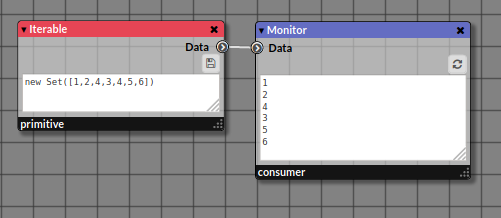

# Iterable

_Pullable Node emitting a stream of an iterable primitive/object (String, Array, etc.)_

| Screenshot of the node |
|------------------------|
|Legend|


## 1. Inputs

This node is a Producer of data and thus has no input socket.

_None_

## 2. Properties
   
### Property Name

_The text area allows to define iterable objects like String or Array (see below for description)._

### 2.1. String

For defining a String, you must enclose your text by single (or double quotes). For example,

```javascript
// This is a String
'Hello'
'1234'
"Yes,I'm a String!"
```
The Iterable will emit the characters of the String. If the input String is 'Hello', the iterable will emit <kbd>H</kbd>, <kbd>e</kbd>, <kbd>l</kbd>, <kbd>l</kbd>, and <kbd>o</kbd>.

For multiline String, use the back quotes <kbd>`</kbd> instead of single or double quotes...
```javascript
// A multi-line String
`Hello
world
`
```
> **Note**: In multiline String, the end of each line will appear as a special character in the stream. That is why, it is convenient to filter all the special characters by a _Filter_ node.

### 2.2. Array

For defining an Array, you must enclose your series of items by square brackets <kbd>[</kbd> and <kbd>]</kbd>.

### 2.3. Other Data Structures

#### Use of `Map`, `Set`, etc.

For example, you can use the collection `Set` allowing the storage of non redundant items.

```javascript
new Set([1,2,4,3,4,5,6])
```
This _iterable_ will emit the following not redundant numbers <kbd>1</kbd>, <kbd>2</kbd>, <kbd>4</kbd>, <kbd>3</kbd>, <kbd>5</kbd>, and <kbd>6</kbd>.

|  |
|------------------------|
|Use of a `Set` for defining non-redundant numbers|

> **Exercise**: Try to replace the Array of numbers by the String 'Hello'. Try to figure out what will be the result? What happens?

#### Using more sophisticated code to generate the iterable data

> **Note**: This is only for expert programmer because we have to wrap the data into a IIFE function.

For example, a Map object may be defined as follows.

```javascript
( () => {
  let map = new Map();
  map.set('a',100);
  return map;
})()
```


## 3. Outputs

### Output Name

_A stream of items_

## 4. Example

|  |
|------------------------|
|The _Iterable_ is composed of an Array of numbers|


