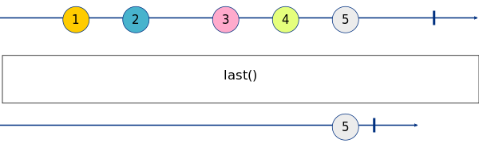

# Last

_Emit the last element of a stream._


|  |
|------------------------|
|Node Last|

This node is equivalent to the [Rx map](http://reactivex.io/documentation/operators/map.html).

**Marble Diagram[<sup name="f1">[1]</sup>](#1)**

|  | 
|------------------------------------------|
| **Fig. 1**: Emit the last element of the stream.|

## 1. Inputs

### 1.1. Input _x:any_

_Any element in the stream_

## 2. Properties

_None_
 
### 3. Outputs

### 3.1. Output _Result:any_

_A value of any type._

## 4. Example

TODO

## 5. ## See Also

- First [[Link]](./first.md)
- Take [[Link]](./take.md)
---

<b name="1">[1]</b>: Generated by https://rx-marbles-online.herokuapp.com with the following syntax...[[Back]](#f1)
```
marble last_marble
{
    source a:     +--1-2--3-4-5--|
    operator last(): +-----------5|
}
```
