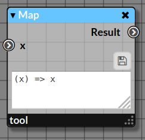

# Map

_Apply a function to all the elements passing via the node_

|  |
|------------------------|
|Node Map with the default _identity_ function|

This node is equivalent to the [Rx map](http://reactivex.io/documentation/operators/map.html).

**Marble Diagram[<sup name="f1">[1]</sup>](#1)**

|  | 
|------------------------------------------|
| **Fig. 1**: Marble Diagram multiplying all the elements by 10.  |

## 1. Inputs

### 1.1. Input _x:any_

_Any element in the stream_

## 2. Properties

### 2.1. Function

_A function applying some computation to the input. This function takes one argument `x` corresponding to the element in the stream and returns a value._
_By default, this function is the Identity function returning the same value `x`._

> **Note**: The code must be saved by clicking on the floppy-disk icon (💾) to send the modified code in the stream.
 

_This function is an anonymous function and must follow the JavaScript syntax below_

```javascript
function (x) {
  // Do something...
  // Return a value
}
```

## 3. Outputs

### 3.1. Output _Result:any_

_A value of any type._

## 4. Example

From a collection of emails defined as an Array of String (below), ...

```javascript
['james@hello.com',
'oliver@mail.fr',
'chris@send.eu',
'barbara@msg.fr'
]
```

... we want to extract their names and domains using `map`.

|  | 
|------------------------------------------|
| **Fig. 2**: Extraction of names and domains from a series of emails. The node `iterable` allows to emit successively the emails in the stream. |

#### JavaScript code

```javascript
const source$ = cbag.fromIter(['james@hello.com',
'oliver@mail.fr',
'chris@send.eu',
'barbara@msg.fr'
]);
```

The map is used for that purpose...

```javascript
cbag.map( (x) => {
  const [name,domain] = x.split('@');
  return {name,domain};
})(source$);
```

The result is...

```javascript
{"name":"james","domain":"hello.com"}
{"name":"oliver","domain":"mail.fr"}
{"name":"chris","domain":"send.eu"}
{"name":"barbara","domain":"msg.fr"}
Completed!
```
---

<b name="1">[1]</b>: Generated by https://rx-marbles-online.herokuapp.com with the following syntax...[[Back]](#f1)
```
marble map_marble
{
    source a:     +--1-2--3-4-5--|
    operator map((x)=>x*10): +--(10)-(20)--(30)-(40)-(50)--|
}
```
