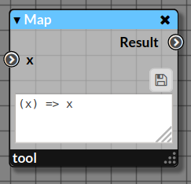
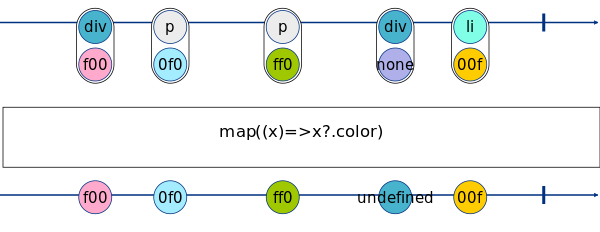

# Pluck

_Extract value from a specific property of all the elements passing in the node._
_The node `pluck` is a specific case of [`map`](./map.md) which must be used._

|  |
|------------------------|
|Node Map with the default _identity_ function|

This node is equivalent to the [Rx map](http://reactivex.io/documentation/operators/map.html).

**Marble Diagram[<sup name="f1">[1]</sup>](#1)**

|  | 
|------------------------------------------|
| **Fig. 1**: Extraction of the property `color`.|

## 1. Inputs

### 1.1. Input _x:any_

_Any element in the stream_

## 2. Properties

### 2.1. Function

_A function applying some computation to the input. This function takes one argument `x` corresponding to the element in the stream and returns a value._
_For `pluck`, the function looks like:_

```javascript
(x) => x?.property
```
... this is equivalent to the ternary operator...

```javascript
(x) => (x.property) ? x.property : undefined
```

> **Note**: The code must be saved by clicking on the floppy-disk icon (💾) to send the modified code in the stream.
 
### 3. Outputs

### 3.1. Output _Result:any_

_A value of any type._

## 4. Example

From a collection defined as an Array of objects containing two properties `widget` and `color` (below), ...

```javascript
[
  {widget:'div',color:'#f00'},
  {widget: 'p', color: '#0f0'},
  {widget: 'p', color: '#ff0'},
  {widget: 'div'},
  {widget: 'li',color: '#00f'}
]
```

... we want to extract their color values using `map`.

The function for `map` is the following...

```javascript
(x) => x?.color
```

|  | 
|------------------------------------------|
| **Fig. 2**: Extraction of colors from a series of objects.|
| The node `iterable` allows to emit successively the objects in the stream. |

## 5. See Also

- Map [[Link]](map.md)

---

<b name="1">[1]</b>: Generated by https://rx-marbles-online.herokuapp.com with the following syntax...[[Back]](#f1)
```
marble pluck_example
{
    source a:     +--{div,f00}-{p,0f0}--{p,ff0}--{div,none}-{li,00f}-|
    operator map((x)=>x?.color): +--(f00)-(0f0)--(ff0)--(undefined)-(00f)-|
}
```
