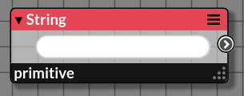
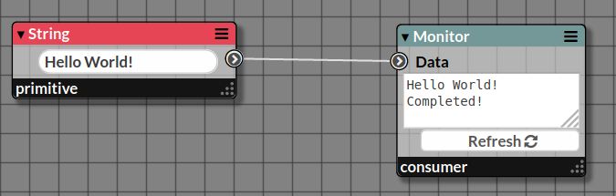

# Node String

_Pullable node emitting a text line_

|  |
|------------------------|
|Screenshot of a _String_ Node|

## Inputs

### Input Name

_None_

## Properties

### Property Name

_Description_

## Outputs

### Output Name

_A String_

## Example

