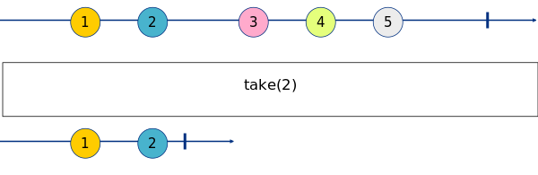

# Take

_Emit the first `n` elements of the incoming stream_

|  |
|------------------------|
|Node Take with the default number of elements.|

This node is equivalent to the [Rx take](http://reactivex.io/documentation/operators/take.html).

**Marble Diagram[<sup name="f1">[1]</sup>](#1)**

|  | 
|------------------------------------------|
| **Fig. 1**: Marble Diagram.  |

## 1. Inputs

### 1.1. Input _x:any_

_Any element in the stream_

## 2. Properties

### 2.1. Function

## 3. Outputs

### 3.1. Output _Result:any_

_A value of any type._

## 4. Example

## 5. See Also

- First
- Last
 
---

<b name="1">[1]</b>: Generated by https://rx-marbles-online.herokuapp.com with the following syntax...[[Back]](#f1)
```
marble map_marble
{
    source a:     +--1-2--3-4-5--|
    operator take(2): +--1-2|
}
```
